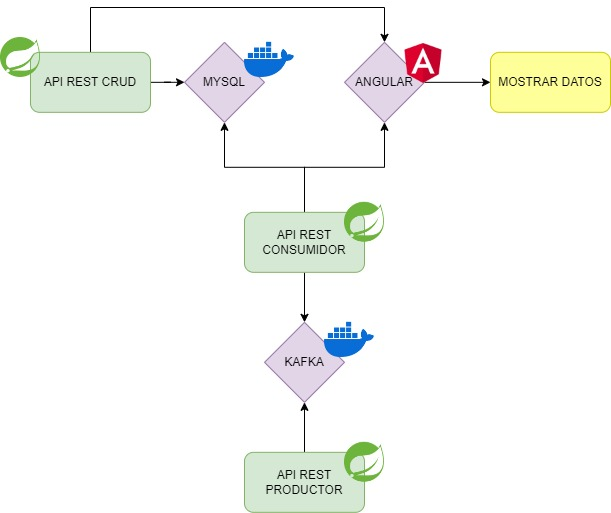

<h1>Proyecto Kafka</h1>
<h3> Ismael Morales</h3>
Proyecto basado en crear dos APIs, un <b>Productor</b> y un <b>Consumidor</b> y conectarlos a la misma cola de <b>Kafka</b>. A este <b>Consumidor</b>
se conectará una base de datos <b>MySQL</b> con una <b>API CRUD</b>. Por otra parte, el <b>Consumidor</b> y la <b>API CRUD</b> también estarán conectados a un proyecto de <b>Angular</b>
para mostrar los datos.

